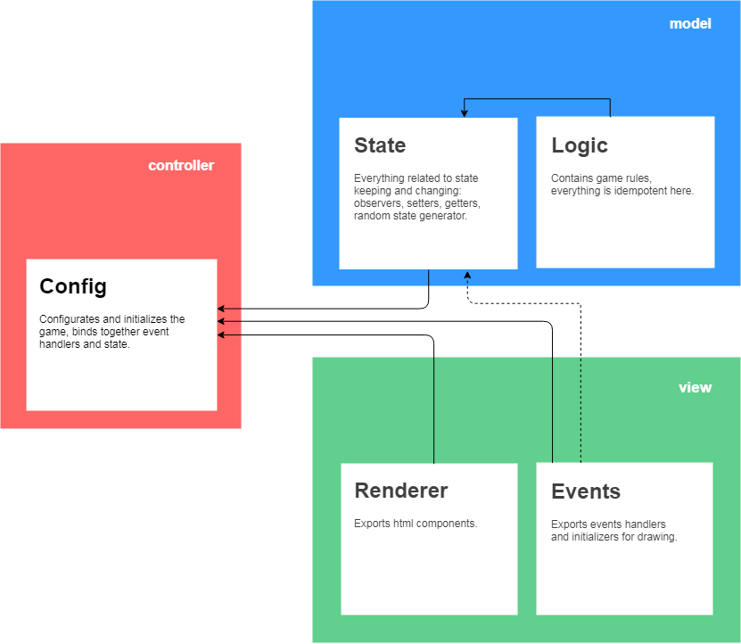

<h2 align="center">Conway's game of life</h2>

  Начал работать с TDD: вся логика была создана после тестов. Потом начал делать хтмл и обработку событий, с ними так уже не вышло, они тестами покрывались по факту.
  Архитектура отдаленно напоминает MVC но сознательно к ней не приводилась, работа больше по наитию.

   Есть пять основных блоков - каждый в отдельном файле: состояние, события, рендер, логика и конфиг.

  <ul>
    <li>
      События (events.js) - содержит обработчики событий и функцию анимации запускающую draw, сама draw тоже тут, логически она обработчик requestAnimationFrame. Обработчики получают модель в параметрах и могут вызывать вызывать на ней события и подписываться на изменения
    </li> 
    <li>
      Рендер (html-renderer.js) - это по сути шаблон, несколько компонентов принимающих параметры и отдающих HTML, заполненный этими параметрами
    </li>
    <li>
      Логика (logic.js) - правила игры, выполнены в форме чистых функций
    </li>
    <li>
      Состояние (state.js) - это самый близкий кандитат на модель, содержит все что относится к состоянию: обсерверы, сеттеры, геттеры, генератор сетки
    </li>
    <li>
      Конфиг (index.js) - собирает все в кучу, назначает селекторы и подписи для интерфейса, связывает обработчики и состояние и запускает игру
    </li>
    
  </ul>

<h2>How to use:</h2>
<ul>
  <li>
    Clone the project to your local environment:
    

      <code>
        git clone https://github.com/alextsk/conway-game-of-life.git
      </code>
    

  </li>
  <li>
    Install dependencies with
    

      <code>
        npm install
      </code>
    

    or
    

      <code>
        yarn install
      </code>
    

  </li>
  <li>
    Run the project with
    

      <code>
        npm run serve
      </code>
    

    and open the browser with the url given you by webpack, usually it is 
    

      <code>
         http://localhost:8080
      </code>
    

  </li>
  <li>
    Build the project with
    

      <code>
        webpack
      </code>
    

  </li>
  <li>
    run tests with
    

      <code>
        npm run test
      </code>
    

  </li>
</ul>
  
